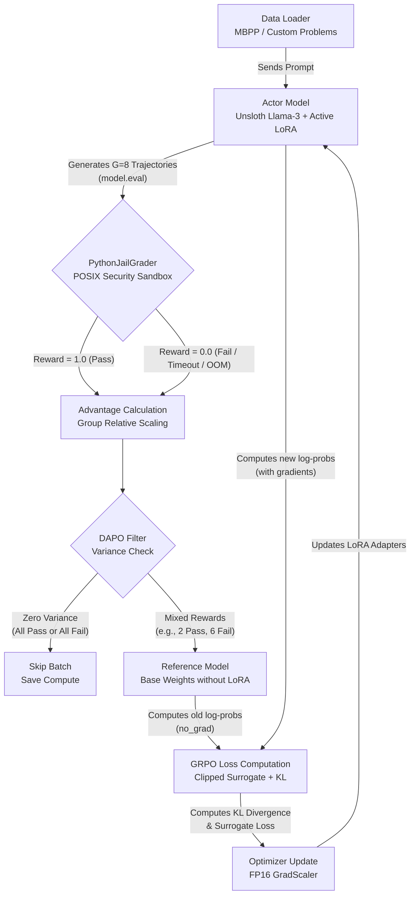

# RLVR Framework Architecture

This document outlines the architecture of the **Reinforcement Learning with Verifiable Rewards (RLVR)** framework we built. It leverages Unsloth for ultra-fast LoRA training, a custom GRPO algorithm, and a POSIX-level security sandbox for evaluating AI-generated code.

## System Flowchart

The following diagram illustrates a single training step (processing one prompt) through the pipeline:

---

## Core Components

### 1. The Actor Model (`hf_llm.py`)
- **Engine**: Powered by [Unsloth](https://github.com/unslothai/unsloth) for extreme memory efficiency and speed. 
- **Structure**: Uses a highly capable base model (like Llama-3.1-8B-Instruct) loaded in 4-bit quantization, with trainable LoRA (Low-Rank Adaptation) adapters attached.
- **Role**: During the rollout phase, it generates $G$ (usually 4 to 8) different Python completions for the exact same problem using temperature sampling. 

### 2. The Verifiable Environment (`sandbox_grader.py`)
- **Engine**: A custom low-level Linux POSIX sandbox.
- **Role**: It takes the AI's generated code, combines it with the secret test assertions, and executes it.
- **Security**: Because the AI's code is untrusted and could contain infinite loops or malicious commands, the sandbox uses `subprocess` with `preexec_fn` to enforce kernel-level constraints *before* the code runs:
  - **Memory Cap** (`RLIMIT_AS`) to prevent Out-Of-Memory (OOM) bombs.
  - **CPU Cap** (`RLIMIT_CPU`) to kill infinite loops.
  - **Disk Cap** (`RLIMIT_FSIZE`) to prevent disk exhaustion.
  - **Privilege Drop** (`setuid/setgid`) to execute as a restricted user.

### 3. Group Relative Processing (`rewards.py`)
- **Role**: Instead of using a separate Critic neural network (which consumes massive VRAM), GRPO normalizes rewards relative to the group.
- **Advantage Calculation**: It calculates the mean and standard deviation of the rewards for the $G$ completions. Completions that performed better than the group average get a positive advantage; those that performed worse get a negative advantage.
- **DAPO (Drop All-Pass/All-Fail)**: An efficiency filter. If all $G$ completions failed, or all $G$ passed, the variance is zero. The gradient would be zero anyway, so we skip the expensive backpropagation step entirely to save GPU compute time.

### 4. The GRPO Trainer (`grpo_trainer.py`)
- **Reference Policy**: Temporarily disables the LoRA adapters (`with model.disable_adapter()`) to compute the probability that the *original* untrained model would have generated the tokens.
- **Loss Function**: Calculates a PPO-clipped surrogate loss using the importance ratio (Current Prob / Old Prob) multiplied by the Advantage.
- **KL Penalty**: Applies an exact per-token KL divergence penalty to ensure the model doesn't drift too far into mode collapse or lose its language coherence while chasing the reward.
- **Mixed Precision Update**: Uses PyTorch's `GradScaler` to safely compute gradients in FP16 (for speed) while applying the optimizer updates in FP32 (preventing NaN crashes).
